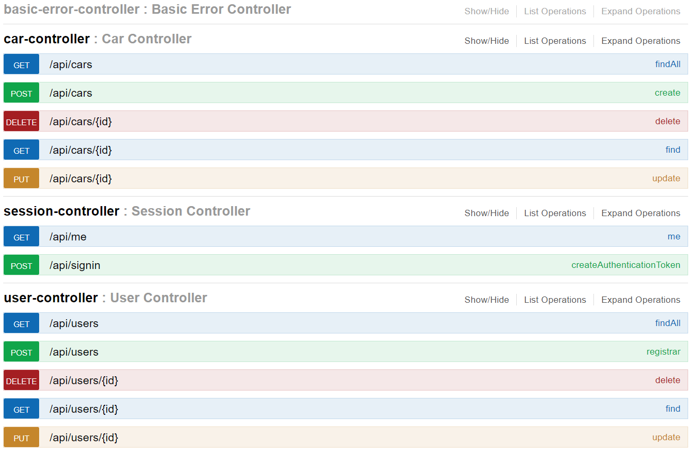
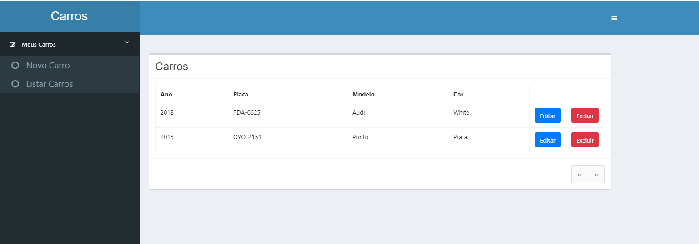

Aplicação criada utilizando as tecnologias Spring boot e Angular

Sistema responsável por cadastrar usuarios e carros.

## Requisitos:

- RF01 - Implementação do endpoint de autenticação
- RF02 - Implementação do endpoint de usuarios
- RF03 - Implementação do endpoint de carros

- RN01 - Implementação do docker
- RN02 - Autalização do readme
- RN03 - Publicação no heroku
- RN04 - Documentação Swagger

## Construído com:

- [Spring Boot](https://spring.io/projects/spring-boot) - Responsável por criar o microserviço e realizar o seu processamento e persistência.
- [Maven](https://maven.apache.org/) - Ferramenta de build automático.
- [Junit](https://junit.org/junit5/) - Ferramenta utilizar para criação dos testes unitários
- [Mockito](https://site.mockito.org/) - Ferramenta utilizada para realizar mock de objetos referente a limitação de ambiente(dev,teste e produção).
- [Docker](https://www.docker.com/) - Ferramenta utilizada para simular o ambiente de testes de forma íntegra.
- [Insominia](https://insomnia.rest/) - Ferramenta utilizada para realizar testes de chamadas via rest.
- [Swagger](https://swagger.io/) - Ferramenta utilizada para documentação da API construída neste projeto.
- [Jenkins](https://jenkins.io/) - Ferramenta responsável pela execução da automatização de testes e integração contínua.
- [Angular](https://angular.io/) - Framework responsável pela construção de interface gráfica em HTML e CSS.
- [Heroku](https://www.heroku.com/) - Plataforma cloud utilizada para realizar o deploy do frontend e backend.


## Executando o projeto:

## Executando sem o Docker(ter o jdk 1.8 instalado na máquina):

```sh
$ mvn spring-boot:run
```

## Executando com o Docker:

- Realizar o clone do [github](https://github.com/juliherms/ChallengeUserCars);
- Realizar a instalação das dependências com o seguinte comando:

```sh
$ mvn clean package
```

- Cria um Docker com o Java 1.8 e executar a aplicação na porta 8080.

```sh
$ docker build -t server-admin:v1 .
$ docker-compose -f docker-spring-admin.yml up
```

## Executando o Jenkins:

- Executar os respectivos comando abaixo para criar a imagem do jenkins no Docker:

```sh
$ cd docker
$ docker build -t jenkins_juliherms:latest .
$ docker-compose -f docker-jenkins.yml up
```

- Você pode configurar o script de pipeline que se encontra no diretório pipeline/ . O resultado será o descrito abaixo:


## Documentação API

- Acessar a segunte url: http://localhost:8080/swagger-ui.html



## Frontend

- Realizar o clone do [github](https://github.com/juliherms/ChallengeUserCars);
- Realizar a instalação das dependências com o seguinte comando:

```sh
$ npm install
$ ng serve -o
```



## Publicação

- Você pode acessar a API publicada no heroku neste link : https://usuarioscarros.herokuapp.com/api/users
- Também foi criado um frontend básico para acesso a API, link: https://carrosweb.herokuapp.com/login

## Solução

- A aplicação foi desenvolvida com o spring boot fazendo uso de suas injeções de dependências, spring data e o jackson para conversão dos objetos em json. 
- Fiz uso do docker tanto para publicar a solução com o servidor tomcat embutido e bem como instância o jenkins e criar a sua pipeline.
- Foi implementado teste unitários e testes integrados 
- A pipeline do Jenkins é responsável por executar todos os testes e realizar deploy em container docker
- Com a utlização do Swagger é possível que qualquer interessado em integra com o microserviço tenha o conhecimento dos endpoints e parâmetros necessários.

## Considerações

- Para esta API foi utilizado o framework spring boot, uma das vantagens deste microframework  é a facilidade para criar mocroserviços de forma independente
utilizando o mínimo do spring. O fato de ter o tomcat já embutido ajuda bastante.

- Para testes unitários foi utilizado o junit, já para testes de integração foi utilizado o mock mvc. O build o Maven é responsável por executar os testes da aplicação, ou seja o build 
somente será disponibilizado se a aplicação passar por todos os testes implementados.

- Em relação ao ambiente foi utilizado o Docker com o objetivo de isolar a instalação e execução do programa. O Jenkins é a ferrmenta responsável por automatizar o Delivery com o conceito de CI e CD através
da pipeline implementada.

- Também foi utilizado o heroku para publicação da nossa API na nuvem. O grande segredo para publicar neste host é basicamente o arquivo procfile.

- Como frontend utilizei o Angular, não fiz uso das melhoras práticas do framework(ex: service genérico, criação de módulos, diretivas e componentes), pois o foco em sí foi na webapi.