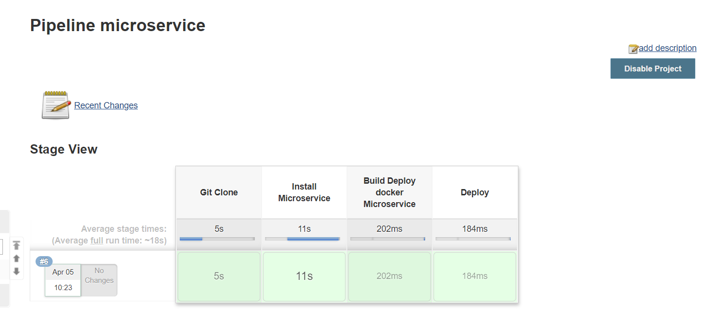

Aplicação criada utilizando as tecnologias Spring boot e Angular

Sistema responsável por cadastrar usuarios e carros.

## Requisitos:

## Construído com:

- [Spring Boot](https://spring.io/projects/spring-boot) - Responsável por criar o microserviço e realizar o seu processamento e persistência.
- [Maven](https://maven.apache.org/) - Ferramenta de build automático.
- [Junit](https://junit.org/junit5/) - Ferramenta utilizar para criação dos testes unitários
- [Mockito](https://site.mockito.org/) - Ferramenta utilizada para realizar mock de objetos referente a limitação de ambiente(dev,teste e produção).
- [Docker](https://www.docker.com/) - Ferramenta utilizada para simular o ambiente de testes de forma íntegra.
- [Insominia](https://insomnia.rest/) - Ferramenta utilizada para realizar testes de chamadas via rest.
- [Swagger](https://swagger.io/) - Ferramenta utilizada para documentação da API construída neste projeto.
- [Jenkins](https://jenkins.io/) - Ferramenta responsável pela execução da automatização de testes e integração contínua.
- [Angular](https://angular.io/) - Framework responsável pela construção de interface gráfica em HTML e CSS.
- [Heroku](https://www.heroku.com/) - Plataforma cloud utilizada para realizar o deploy do frontend e backend.


## Executando o projeto:

## Executando sem o Docker(ter o jdk 1.8 instalado na máquina):

```sh
$ mvn spring-boot:run
```

## Executando com o Docker:

- Realizar o clone do [github](https://github.com/juliherms/ChallengeUserCars);
- Realizar a instalação das dependências com o seguinte comando:

```sh
$ mvn clean package
```

- Cria um Docker com o Java 1.8 e executar a aplicação na porta 8080.

```sh
$ docker build -t server-admin:v1 .
$ docker-compose -f docker-spring-admin.yml up
```

## Executando o Jenkins:

- Executar os respectivos comando abaixo para criar a imagem do jenkins no Docker:

```sh
$ cd docker
$ docker build -t jenkins_juliherms:latest .
$ docker-compose -f docker-jenkins.yml up
```

- Você pode configurar o script de pipeline que se encontra no diretório pipeline/ . O resultado será o descrito abaixo:




## Publicação

- Voce pode acessar a API publicada no heroku neste link(https://usuarioscarros.herokuapp.com/api/users)